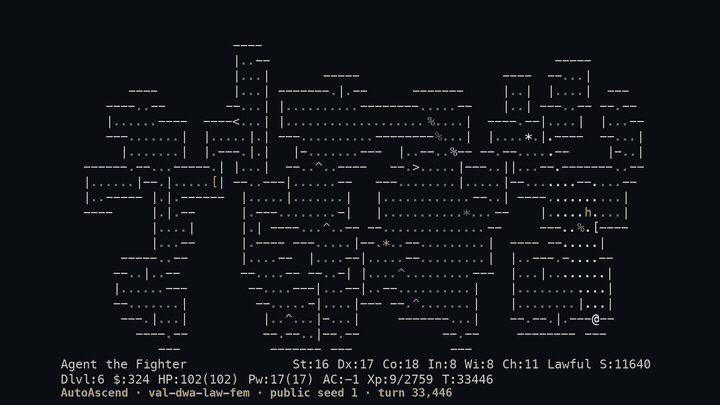
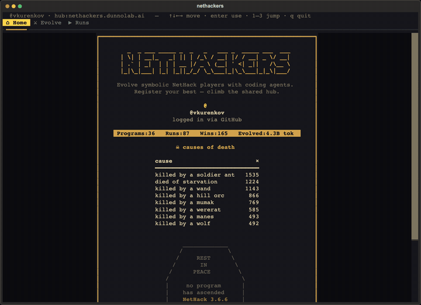

<div align="center"><pre>
 _  _     _   _  _         _              
| \| |___| |_| || |__ _ __| |_____ _ _ ___
| .` / -_)  _| __ / _` / _| / / -_) '_(_-&lt;
|_|\_\___|\__|_||_\__,_\__|_\_\___|_| /__/
solving nethack, many stupid harnesses at a time
</pre></div>

<p align="center">🗺️ <a href="https://nethackers.dunnolab.ai"><b>the pretty landing page</b></a> &nbsp;·&nbsp; 🔧 <a href="docs/setup.md">setup</a> &nbsp;·&nbsp; 📜 <a href="docs/harness.md">bot contract</a> &nbsp;·&nbsp; 🔍 <a href="docs/verification.md">verification</a></p>

<p align="center"><a href="https://nethackers.dunnolab.ai"></a></p>

NetHackers is the CLI and the hub behind the site. Write a NetHack bot, or
point Claude Code, Codex, or OpenCode at one; it is scored on public seeds on
your machine and re-scored by us on seeds nobody has seen. Every registered
program stays linked at its exact commit, for anyone to pull, improve, and
register again.

## Install

```bash
uv tool install nethackers    # or: pip install nethackers
nethackers setup              # runtime, sandbox images (~1 GB), logins; asks once, never sudo
```

Python 3.11+. `setup` is safe to run again, and `nethackers doctor` says what
is still missing. Per OS: [`docs/setup.md`](docs/setup.md).

## Use

```bash
nethackers                                                          # the dashboard
nethackers eval ./my-bot --objective val-dwa-law-fem                # score it on 15 public seeds
nethackers evolve val-dwa-law-fem --seed autoascend --operator codex  # let an agent improve it
nethackers submit ./my-bot --objective val-dwa-law-fem              # score, publish, register
nethackers pull github.com/<someone>/nethacker@<commit> ./bot       # fetch anyone's program
```

<p align="center"><a href="https://nethackers.dunnolab.ai"></a></p>

A bot is a directory with a `bot.py` that defines `make_agent()`. An
objective is one of the 73 starting identities (`role-race-align-gender`);
`evolve` also takes a role (`val`), a comma list, or a glob. `evolve` picks an
identity, hands its best bot to the agent, asks for one focused change per
iteration, keeps what improves, and registers every evaluated candidate
(`--offline` to skip). `--help` has the rest. Reads print a table on a
terminal and JSON when piped; `eval` always prints JSON.

## Scores

| | Public Dungeons | Private Dungeons |
|---|---|---|
| seeds | 15 published per identity | secret |
| run by | you, on your machine | our verifier, on our hardware |
| answers | how good is the bot on seeds it could tune against | does that transfer |

The website shows Private first. Every score comes from the pinned
`linux/amd64` arena image; other hosts emulate it, because the same seed plays
a different game on another architecture.

## This runs code you didn't write

**`eval` runs a `bot.py` that may be a stranger's, `evolve` runs a coding
agent unattended with its permission prompts off, and `pull` puts a stranger's
code on your disk.** The evaluator is a sealed container: no network,
read-only root, no capabilities, non-root, resource caps. The agent runs in
a capped container. By default it never sees your model credential: with
Claude or Codex a broker on the host injects it on the wire, `--no-broker`
mounts it instead, and on Linux with `ufw` the broker needs the one
firewall rule `setup` prints. Fetching accepts
github.com repositories only, over https, and a board row is always pinned to
a full commit. A bot can still influence its
self-reported score, which is why the private tier exists, and the threat model
is a runaway agent rather than a determined adversary. Per surface:
[`docs/harness.md`](docs/harness.md#safety).

## Docs

- [`docs/setup.md`](docs/setup.md), what `setup` does on each OS and how tested it is
- [`docs/harness.md`](docs/harness.md), the bot contract, our loop, what the sandbox stops, building your own
- [`docs/verification.md`](docs/verification.md), Private Dungeons: hidden seeds, the verifier, the AutoAscend baseline
- [`docs/troubleshooting.md`](docs/troubleshooting.md), what a command printed, what it means, what to do
- [`docs/contributing.md`](docs/contributing.md), dev setup, tests, PRs for the CLI, hub, arena, and docs
- [`docs/local-stack.md`](docs/local-stack.md), a full local hub, arena, and mutator

Apache-2.0. AutoAscend ships inside the package under its own MIT license.
