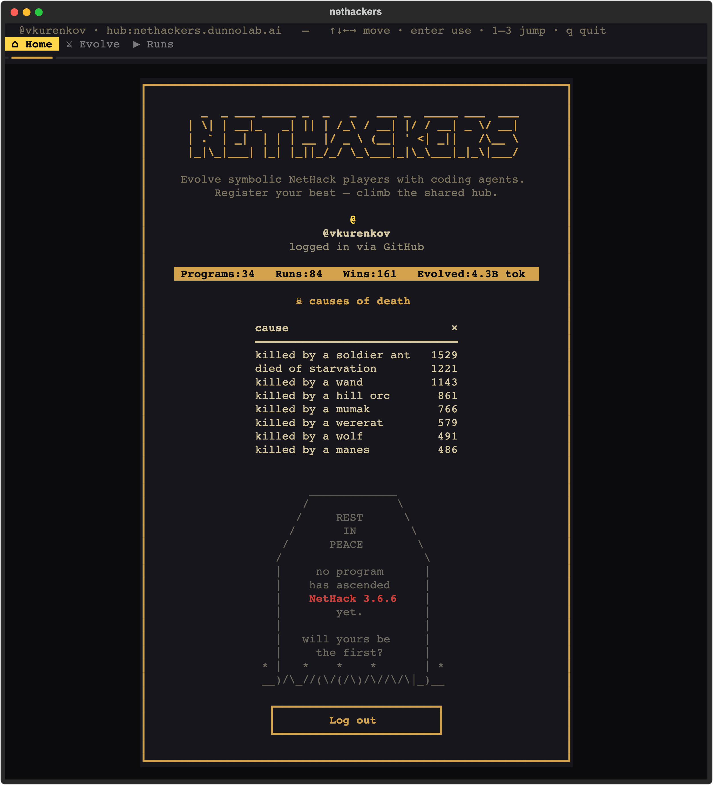

<pre align="center">
 _  _     _   _  _         _              
| \| |___| |_| || |__ _ __| |_____ _ _ ___
| .` / -_)  _| __ / _` / _| / / -_) '_(_-&lt;
|_|\_\___|\__|_||_\__,_\__|_\_\___|_| /__/
</pre>

<p align="center"><i>solving nethack, many stupid harnesses at a time</i></p>
<p align="center"><a href="https://nethackers.dunnolab.ai"><code>nethackers.dunnolab.ai</code></a></p>

<p align="center">
<a href="https://nethackers.dunnolab.ai"></a>
</p>

NetHackers is an open effort to write the first program that wins NetHack.
This is the CLI and the hub behind [nethackers.dunnolab.ai](https://nethackers.dunnolab.ai).
You write a bot, or point a coding agent at one. It is scored on fixed seeds
in a sandbox on your machine and re-scored by us on seeds nobody has seen.
The hub keeps a link to every registered program, your repo at an exact
commit, for anyone to pull, improve, and register again; the best per
starting character are the elites it shows first.

## Install

```bash
uv tool install nethackers      # or: pip install nethackers
nethackers setup
```

Python 3.11+. `setup` gets the machine ready: it shows a plan, asks once,
runs the logins first (GitHub, `gh`, your coding agent), installs what one
command can install without `sudo`, starts the container runtime, and pulls
the sandbox images, about 1 GB. Anything that needs `sudo` or a click is
printed for you instead. It is safe to run again, and `--for eval` (or
`evolve`, `publish`, `browse`) sets up only that much. Per-OS details and how
tested each step is: [`docs/setup.md`](docs/setup.md).

`nethackers doctor` says what this machine can do and what to fix.

## Use

```bash
nethackers                                              # the dashboard
nethackers eval ./my-bot --objective val-dwa-law-fem    # score a bot on its 15 public seeds
nethackers evolve val-dwa-law-fem --seed autoascend --operator codex --iterations 20
nethackers submit ./my-bot --objective val-dwa-law-fem  # publish to github.com/<you>/nethacker and register
nethackers pull github.com/<someone>/nethacker@<commit> ./bot
```

A bot is a directory with a `bot.py` that defines `make_agent()`. That is
the whole contract; [`docs/harness.md`](docs/harness.md) has the rest. An
objective is one of the 73 starting identities (`role-race-align-gender`), a
role (`val`), a comma list, or a glob (`val-*-law-*`).

`evolve` hands the current best bot to the coding agent (Claude Code, Codex,
or OpenCode) in a container, asks for one focused change, scores it on the
15 seeds, and keeps it where it improved. Every evaluated candidate is pushed
to your public `nethacker` repo and registered, not only the winners;
`--offline` runs the loop without publishing anything.

`frontier`, `board`, `elites`, `show`, and `search` print what the dashboard
shows. Every command prints JSON when piped.

## Scores

Every program carries two. Public Dungeons: 15 published seeds per identity,
run by you. Private Dungeons: secret seeds, re-run by our verifier on our
hardware, which is the number the website shows first. All scores come from
the pinned `linux/amd64` arena image; other hosts emulate it (Rosetta on
Apple Silicon, which `setup` turns on), because the same seed plays a
different game on another architecture. How the private tier works:
[`docs/verification.md`](docs/verification.md).

## This runs code you didn't write

`eval` runs a `bot.py` that may be a stranger's, `evolve` runs a coding agent
with its permission prompts off and unattended, and `pull` puts a stranger's
code on your disk. The evaluator is a sealed container: no network, read-only
root, every capability dropped, non-root, resource caps. Fetching accepts only
`github.com/<owner>/<repo>@<commit>` over https. The agent runs in its own
capped container with a wall-clock timeout. A bot can still influence its own
self-reported score, which is why the private tier exists, and the threat
model is a runaway agent, not a determined adversary. Per surface:
[`docs/harness.md`](docs/harness.md#3-safety-and-sandboxing).

## Docs

| Doc | Covers |
|---|---|
| [`docs/setup.md`](docs/setup.md) | what `setup` does on each OS, and how tested it is |
| [`docs/harness.md`](docs/harness.md) | the bot contract, our harness, safety, building your own |
| [`docs/verification.md`](docs/verification.md) | the private tier: hidden seeds, the verifier, the AutoAscend floor |
| [`docs/troubleshooting.md`](docs/troubleshooting.md) | symptom, cause, fix |
| [`docs/contributing.md`](docs/contributing.md) | dev setup, tests, PRs for the CLI, hub, arena, and docs |
| [`docs/local-stack.md`](docs/local-stack.md) | a full local hub, arena, and mutator |
| [`deploy/README.md`](deploy/README.md) | running the production hub |

Apache-2.0. AutoAscend ships inside the package under its own MIT license
([`src/nethackers/roots/autoascend/LICENSE`](src/nethackers/roots/autoascend/LICENSE)).
